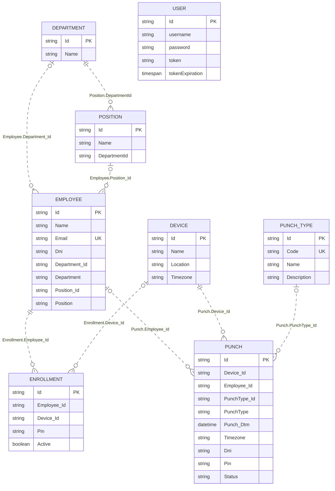
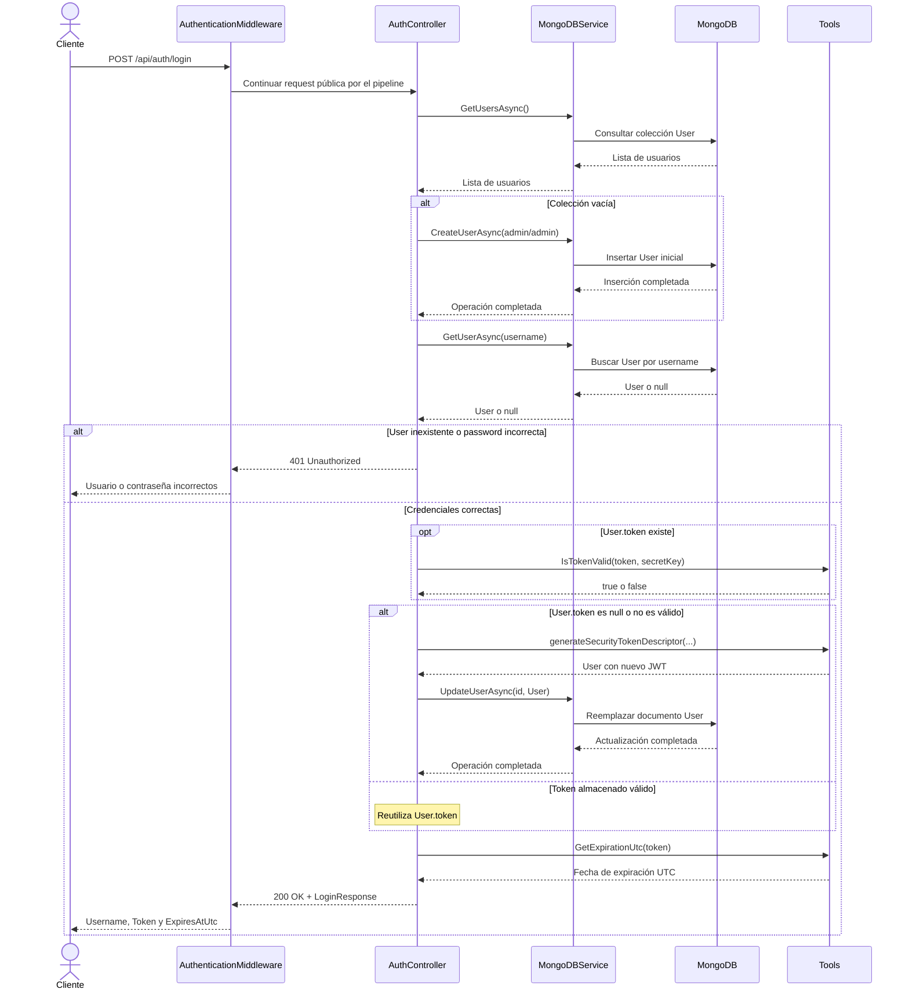
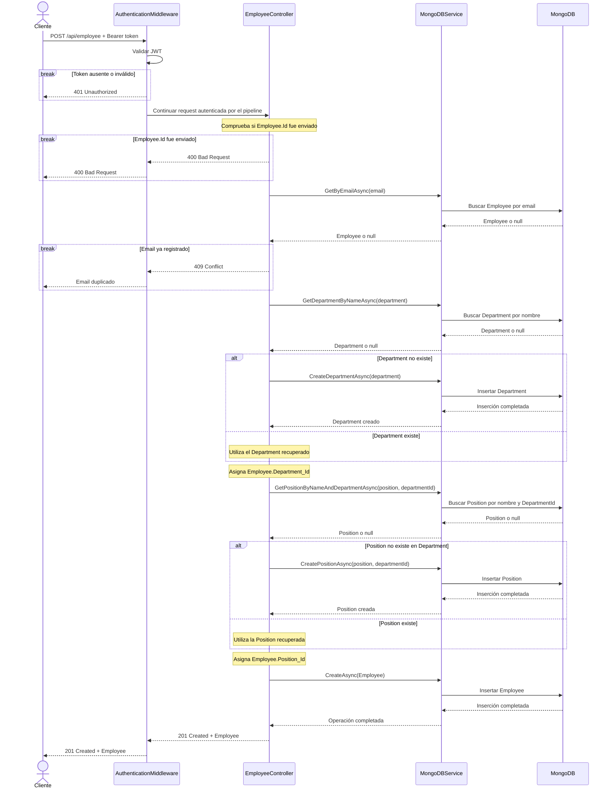
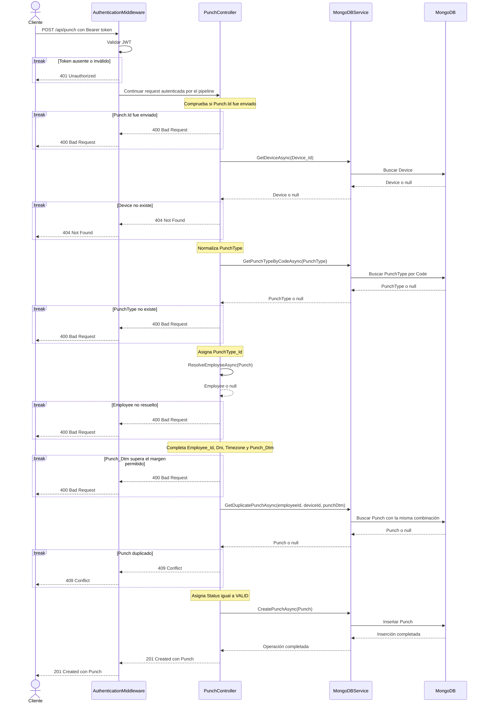
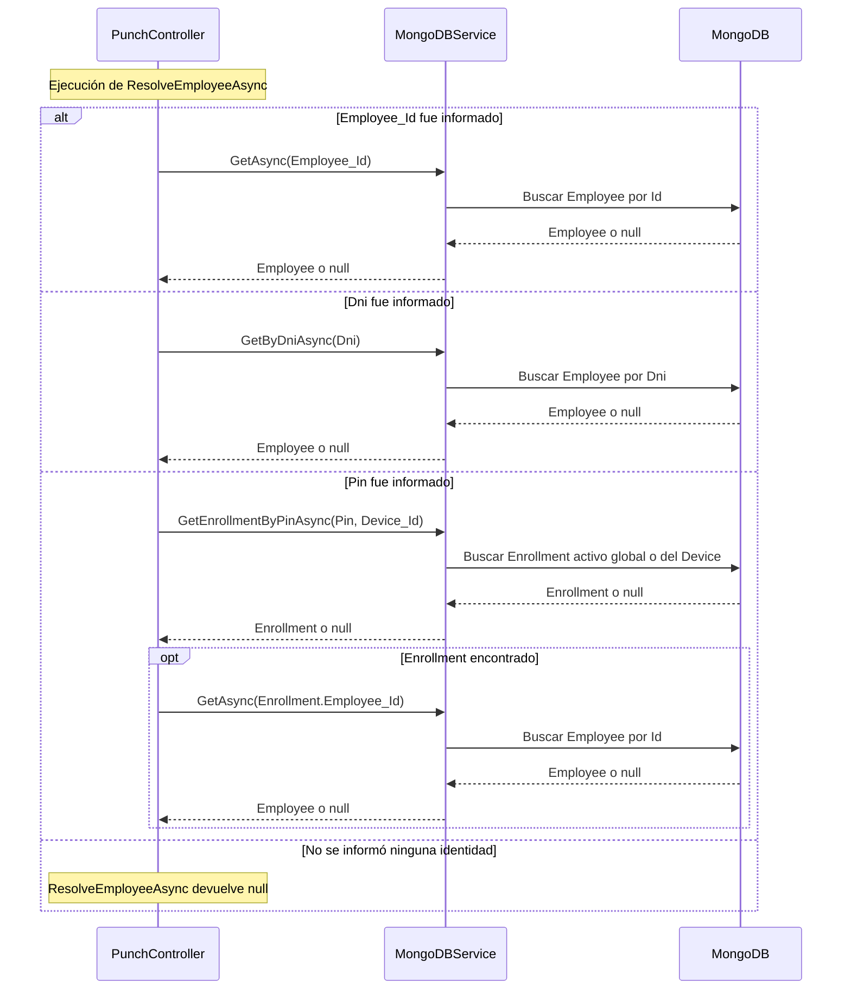

# Análisis técnico

## Arquitectura actual

### Visión general

EmployeeAPI es una API REST construida como un único proyecto web de ASP.NET Core para .NET 8. El archivo `Program.cs` funciona como punto de composición: registra los controllers, enlaza las secciones de configuración con `MongoDBSettings` y `JwtSettings`, registra `MongoDBService` como singleton y configura el pipeline HTTP. Swagger se habilita únicamente cuando el ambiente es `Development`.

La persistencia se realiza en MongoDB. Los controllers reciben una instancia de `MongoDBService` mediante inyección de dependencias y llaman directamente a sus métodos. El constructor `MongoDBService.MongoDBService` crea el cliente, selecciona la base configurada y obtiene las colecciones utilizadas por la aplicación. No existe una capa Repository separada entre este servicio y `MongoDB.Driver`.

La autenticación no utiliza el esquema estándar `AddAuthentication` de ASP.NET Core. `Program.cs` incorpora el middleware propio `AuthenticationMiddleware`, cuyo método `Invoke` permite las rutas públicas definidas en el código y valida el Bearer token de las demás requests. La generación y comprobación de los JWT se apoya además en los métodos estáticos de la clase `Tools`.

> **Inferencia arquitectónica:** el repositorio no asigna un nombre formal a su arquitectura. Por estar compuesto por un solo proyecto desplegable con separación en Controllers, Services y Models, puede caracterizarse como un monolito con separación simple por responsabilidades. Esta denominación es una interpretación de la organización observada, no una definición explícita del código.

### Inicialización previa a las requests

Después de construir la aplicación, `Program.cs` obtiene la instancia de `MongoDBService` y ejecuta, en este orden:

1. `CreateUniqueIndexOnEmailAsync`, para el índice único del email de Employee.
2. `CreateTimekeeperIndexesAsync`, para los índices de Punch y PunchType.
3. `SeedPunchTypesAsync`, para crear los tipos iniciales de marcación cuando la colección está vacía.

Estas operaciones se esperan antes de ejecutar `app.Run()`. No existe un manejo de excepciones alrededor de esta inicialización; por lo tanto, si alguna operación requerida contra MongoDB falla y propaga una excepción, la ejecución no alcanza el punto en que la API comienza a atender requests.

### Recorrido general de una request

1. ASP.NET Core recibe la request y la incorpora al pipeline configurado en `Program.cs`.
2. En ambiente `Development`, `UseSwagger` y `UseSwaggerUI` pueden resolver las rutas correspondientes a Swagger.
3. Para las rutas que continúan, `AuthenticationMiddleware.Invoke` determina si la request es pública. Si requiere autenticación, valida la firma y vigencia del JWT; ante un token ausente o inválido termina el flujo con `401 Unauthorized`.
4. Las requests aceptadas por el middleware continúan hasta el endpoint registrado mediante `MapControllers`, que selecciona el action según los atributos de ruta y método HTTP del controller.
5. ASP.NET Core realiza el binding de parámetros, query strings y bodies. En los modelos que poseen Data Annotations, `[ApiController]` utiliza esas reglas para la validación automática de entrada.
6. El action del controller aplica las reglas propias de la operación y llama uno o más métodos de `MongoDBService`.
7. `MongoDBService` construye filtros y operaciones con `MongoDB.Driver`, y consulta o modifica la colección correspondiente.
8. El resultado vuelve al controller, que retorna un modelo o un resultado HTTP como `CreatedAtAction`, `BadRequest`, `NotFound`, `Conflict` o `NoContent`.
9. ASP.NET Core serializa el resultado y envía la response HTTP al cliente.

Este recorrido representa las operaciones principales del sistema. Algunas rutas tienen pasos adicionales: el login utiliza `Tools` para crear o reutilizar un JWT, mientras que el health check llama a `MongoDBService.PingAsync`. Esos comportamientos se detallan posteriormente en sus flujos específicos.

## Componentes principales y responsabilidades

### Controllers

Los controllers son activados por ASP.NET Core a partir de las rutas registradas mediante `MapControllers` en `Program.cs`. Reciben los datos HTTP, coordinan la operación, llaman a los servicios necesarios y construyen el resultado HTTP. En la implementación actual también contienen varias validaciones y reglas propias del negocio.

| Clase | Responsabilidad confirmada | Dependencias principales |
|---|---|---|
| `AuthController` | Procesar el login, comprobar las credenciales y generar o reutilizar el JWT | `MongoDBService`, `IOptions<JwtSettings>` y `Tools` |
| `HealthController` | Comprobar la conectividad con MongoDB y devolver el estado de salud | `MongoDBService.PingAsync` |
| `EmployeeController` | Coordinar el CRUD de Employee y las consultas de Department y Position | `MongoDBService`, `Employee` y `PatchEmployee` |
| `DeviceController` | Coordinar el CRUD de Device y comprobar nombres duplicados | `MongoDBService` y `Device` |
| `EnrollmentController` | Consultar, crear y eliminar enrolamientos; comprobar las entidades relacionadas y la disponibilidad del PIN | `MongoDBService` y `Enrollment` |
| `PunchController` | Consultar y registrar Punch, administrar PunchType y resolver el Employee de una marcación | `MongoDBService`, `Punch`, `PunchType` y `Employee` |
| `WeatherForecastController` | Generar datos meteorológicos simulados | `ILogger<WeatherForecastController>` |

`WeatherForecastController` está registrado y expone un endpoint, pero es un componente residual que no pertenece a los dominios de personas o asistencia descritos por el challenge.

### MongoDBService

La clase `MongoDBService`, definida en `Services/MongoDBService.cs`, centraliza la comunicación con MongoDB. Su constructor recibe `IOptions<MongoDBSettings>`, crea un `MongoClient`, selecciona la base configurada y obtiene las colecciones utilizadas por la aplicación.

Sus responsabilidades confirmadas son:

- Ejecutar consultas, inserciones, reemplazos y eliminaciones.
- Construir filtros para empleados, enrolamientos y marcaciones.
- Crear y consultar Department y Position.
- Administrar los documentos relacionados con autenticación y asistencia.
- Crear los índices utilizados por Employee, Punch y PunchType.
- Inicializar los PunchType predeterminados.
- Ejecutar el comando de ping utilizado por el health check.

`Program.cs` utiliza el servicio durante el arranque. También lo reciben mediante sus constructores `AuthController`, `HealthController`, `EmployeeController`, `DeviceController`, `EnrollmentController` y `PunchController`. Se registra como singleton, por lo que la aplicación reutiliza la misma instancia durante su ejecución.

`MongoDBService` depende directamente de `MongoDB.Driver`, de `MongoDBSettings` y de los Models persistidos. No existe una interfaz propia ni una capa Repository separada. Describirlo como un componente equivalente a un Repository sería una interpretación arquitectónica; el nombre y la responsabilidad declarados por el código son los de un servicio.

### Middleware de autenticación

La clase `AuthenticationMiddleware`, ubicada en `Models/AuthenticationMiddleware.cs`, se incorpora al pipeline mediante `UseMiddleware` en `Program.cs`. Su método principal es `Invoke(HttpContext context)`.

Sus responsabilidades confirmadas son:

- Responder las requests `OPTIONS`.
- Permitir las rutas públicas definidas en el código.
- Extraer el token del encabezado `Authorization`.
- Validar la firma y vigencia del JWT.
- Responder `401 Unauthorized` si el token está ausente o no es válido.
- Invocar el siguiente componente del pipeline cuando la request puede continuar.
- Agregar manualmente encabezados CORS mediante `SetCorsHeaders`.

Sus dependencias principales son `RequestDelegate`, `IOptions<JwtSettings>`, `JwtSecurityTokenHandler` y los tipos de `Microsoft.IdentityModel.Tokens`. No consulta MongoDB ni depende de `MongoDBService`; valida el token utilizando el secreto configurado.

### Models y tipos auxiliares

La carpeta `Models/` contiene tipos con responsabilidades diferentes:

| Categoría | Clases | Consumidores principales |
|---|---|---|
| Documentos persistidos | `Employee`, `Department`, `Position`, `User`, `Device`, `Enrollment`, `PunchType` y `Punch` | Controllers y `MongoDBService` |
| DTOs HTTP | `LoginRequest`, `LoginResponse` y `PatchEmployee` | `AuthController` y `EmployeeController` |
| Opciones de configuración | `MongoDBSettings` y `JwtSettings` | `Program.cs`, `MongoDBService`, `AuthController` y `AuthenticationMiddleware` |
| Constantes de estado | `PunchStatus` | `Punch` y `PunchController` |
| Utilidad JWT | `Tools` | `AuthController` |
| Componente del pipeline | `AuthenticationMiddleware` | Pipeline configurado en `Program.cs` |

Los documentos persistidos utilizan atributos de `MongoDB.Bson` para representar sus identificadores y ser serializados por el driver. Algunos Models también utilizan Data Annotations para declarar campos obligatorios, longitudes y formatos aceptados. ASP.NET Core emplea esas anotaciones durante el binding y la validación de las requests recibidas por controllers marcados con `[ApiController]`.

`Tools` no representa datos: implementa la generación, validación y lectura de expiración de JWT. De manera similar, `AuthenticationMiddleware` contiene lógica de infraestructura. Por lo tanto, aunque ambos se encuentran físicamente en `Models/`, la carpeta agrupa actualmente documentos, DTOs, configuración y componentes con comportamiento.

### Distribución actual de responsabilidades

La separación existente no constituye capas completamente independientes. Los controllers contienen coordinación HTTP y varias reglas de negocio; `MongoDBService` combina acceso a datos, consultas, índices, inicialización y health check; y algunos Models incluyen validaciones o métodos auxiliares. Esta descripción corresponde al estado actual observado y no implica todavía una propuesta de reestructuración.

## Modelo de datos

### Convenciones de persistencia

La aplicación persiste ocho tipos de documento en MongoDB. En los Models, los identificadores principales se declaran como `string?`, pero el atributo `[BsonRepresentation(BsonType.ObjectId)]` permite que el driver los represente como `ObjectId` en la base de datos.

| Modelo | Colección | Definición del nombre |
|---|---|---|
| `Employee` | `employee` por defecto | Configurable mediante `MongoDB.CollectionName` |
| `User` | `user` por defecto | Configurable mediante `MongoDB.CollectionUsers` |
| `Department` | `Departments` | Definido directamente en `MongoDBService` |
| `Position` | `Positions` | Definido directamente en `MongoDBService` |
| `Device` | `Devices` | Definido directamente en `MongoDBService` |
| `Enrollment` | `Enrollments` | Definido directamente en `MongoDBService` |
| `PunchType` | `PunchTypes` | Definido directamente en `MongoDBService` |
| `Punch` | `Punches` | Definido directamente en `MongoDBService` |

Las referencias entre documentos son lógicas: se almacenan identificadores, pero no existen claves foráneas ni relaciones administradas automáticamente por MongoDB. La aplicación comprueba algunas relaciones desde los controllers antes de insertar datos.

### Dominio de personas y autenticación

#### Employee

Clase definida en `Models/Employee.cs`.

| Campo | Tipo | Propósito y restricciones observadas |
|---|---|---|
| `Id` | `string?` | Identificador principal representado como `ObjectId` |
| `Name` | `string` | Nombre del empleado; no posee Data Annotation explícita |
| `Email` | `string` | Correo; tiene un índice único creado durante el arranque |
| `Dni` | `string?` | Identificador documental opcional; no posee índice único |
| `Department_Id` | `string?` | Identificador lógico del Department |
| `Department` | `string` | Nombre del Department duplicado dentro de Employee |
| `Position_Id` | `string?` | Identificador lógico de la Position |
| `Position` | `string` | Nombre de la Position duplicado dentro de Employee |

`EmployeeController.Post` busca o crea Department y Position, y después asigna sus identificadores a `Department_Id` y `Position_Id`. Estos dos campos no poseen `[BsonRepresentation(BsonType.ObjectId)]`, por lo que su representación persistida es string.

El índice único de `Email` se crea mediante `MongoDBService.CreateUniqueIndexOnEmailAsync`. Las propiedades no anulables de Employee expresan la intención del modelo C#, pero la clase no declara `[Required]`, formato de email ni límites de longitud explícitos.

#### Department

Clase definida en `Models/Department.cs`.

| Campo | Tipo | Propósito y restricciones observadas |
|---|---|---|
| `Id` | `string?` | Identificador principal representado como `ObjectId` |
| `Name` | `string` | Nombre del departamento; sin validaciones ni índice único explícito |

Department puede ser creado implícitamente durante el alta de Employee. Su nombre se copia además en `Employee.Department`.

#### Position

Clase definida en `Models/Position.cs`.

| Campo | Tipo | Propósito y restricciones observadas |
|---|---|---|
| `Id` | `string?` | Identificador principal representado como `ObjectId` |
| `Name` | `string` | Nombre de la posición; sin validación explícita |
| `DepartmentId` | `string` | Identificador lógico del Department al que pertenece |

`MongoDBService.GetPositionByNameAndDepartmentAsync` utiliza conjuntamente `Name` y `DepartmentId` para buscar una Position. No existe un índice único sobre esa combinación. `DepartmentId` tampoco posee `[BsonRepresentation(BsonType.ObjectId)]`, por lo que se almacena como string.

#### User

Clase definida en `Models/User.cs`.

| Campo | Tipo | Propósito y restricciones observadas |
|---|---|---|
| `Id` | `string?` | Identificador principal representado como `ObjectId` |
| `username` | `string` | Nombre utilizado en el login |
| `password` | `string` | Contraseña persistida por el comportamiento actual |
| `token` | `string?` | JWT generado para el usuario |
| `tokenExpiration` | `TimeSpan` | Valor temporal almacenado junto al token |

User no contiene una referencia a Employee ni propiedades de roles o permisos. Su relación con el resto del sistema es exclusivamente la autenticación implementada por `AuthController` y `Tools`.

### Dominio de asistencia

#### Device

Clase definida en `Models/Device.cs`.

| Campo | Tipo | Propósito y restricciones observadas |
|---|---|---|
| `Id` | `string?` | Identificador principal representado como `ObjectId` |
| `Name` | `string` | Obligatorio; entre 2 y 100 caracteres |
| `Location` | `string` | Obligatorio; máximo 150 caracteres |
| `Timezone` | `string` | Obligatorio; máximo 64 caracteres; espera un identificador IANA |

`DeviceController.Post` comprueba si ya existe un dispositivo con el mismo nombre, pero MongoDB no tiene un índice único sobre `Device.Name`.

#### Enrollment

Clase definida en `Models/Enrollment.cs`.

| Campo | Tipo | Propósito y restricciones observadas |
|---|---|---|
| `Id` | `string?` | Identificador principal representado como `ObjectId` |
| `Employee_Id` | `string` | Obligatorio; referencia representada como `ObjectId` |
| `Device_Id` | `string?` | Referencia opcional representada como `ObjectId` |
| `Pin` | `string` | Obligatorio; debe contener entre 4 y 10 dígitos |
| `Active` | `bool` | Indica si puede utilizarse; valor inicial `true` |

`EnrollmentController.Post` comprueba que Employee exista y, cuando se informa `Device_Id`, que Device también exista. Un `Device_Id` con valor limita el PIN a ese dispositivo; un valor `null` representa un enrolamiento global según la búsqueda implementada por `MongoDBService.GetEnrollmentByPinAsync`.

La disponibilidad del PIN se comprueba desde el controller y el servicio. No existe un índice único en MongoDB que represente esa regla.

#### PunchType

Clase definida en `Models/PunchType.cs`.

| Campo | Tipo | Propósito y restricciones observadas |
|---|---|---|
| `Id` | `string?` | Identificador principal representado como `ObjectId` |
| `Code` | `string` | Obligatorio; entre 2 y 20 caracteres |
| `Name` | `string` | Obligatorio; máximo 100 caracteres |
| `Description` | `string?` | Descripción opcional; máximo 250 caracteres |

`PunchType.Code` tiene un índice único. `MongoDBService.SeedPunchTypesAsync` crea los códigos `IN`, `OUT`, `BREAK_IN` y `BREAK_OUT` cuando la colección está vacía.

#### Punch

Clase definida en `Models/Punch.cs`.

| Campo | Tipo | Propósito y restricciones observadas |
|---|---|---|
| `Id` | `string?` | Identificador principal representado como `ObjectId` |
| `Device_Id` | `string` | Obligatorio; referencia representada como `ObjectId` |
| `Employee_Id` | `string?` | Referencia representada como `ObjectId`; puede omitirse en la entrada |
| `PunchType_Id` | `string?` | Referencia representada como `ObjectId`; la completa el controller |
| `PunchType` | `string` | Código obligatorio; entre 2 y 20 caracteres |
| `Punch_Dtm` | `DateTime` | Fecha de la marcación; el controller la normaliza a UTC |
| `Timezone` | `string?` | Zona horaria opcional; máximo 64 caracteres |
| `Dni` | `string?` | Identificador opcional del empleado; máximo 20 caracteres |
| `Pin` | `string?` | PIN opcional de entre 4 y 10 dígitos |
| `Status` | `string` | Estado; comienza como `PENDING` y una creación exitosa lo establece en `VALID` |

Antes de persistir un Punch, `PunchController.Post` completa `Employee_Id`, `PunchType_Id`, `Dni`, `Timezone`, `Punch_Dtm` y `Status` según los datos disponibles. La colección posee un índice único compuesto por `Employee_Id`, `Device_Id` y `Punch_Dtm`.

### Relaciones y restricciones observadas

Las relaciones lógicas confirmadas por los campos y las consultas son:

```text
Department <- Position
Department <- Employee
Position   <- Employee

Employee <- Enrollment -> Device
Employee <- Punch      -> Device
PunchType <- Punch
```

User permanece independiente de Employee y de las entidades de asistencia.

El código permite inferir que un Department puede relacionarse con muchas Position y Employee; y que Employee, Device y PunchType pueden relacionarse con múltiples documentos de asistencia. Estas cardinalidades son una interpretación del diseño, ya que no están declaradas ni aplicadas mediante restricciones referenciales en MongoDB.

Los índices únicos confirmados son:

- `Employee.Email`.
- `PunchType.Code`.
- La combinación `Punch.Employee_Id + Punch.Device_Id + Punch.Punch_Dtm`.

La unicidad de nombres de Device y la disponibilidad de PIN se comprueban en la lógica de aplicación, no mediante índices únicos. Tampoco existe eliminación en cascada: los métodos de eliminación de `MongoDBService` borran únicamente el documento solicitado.

## Diagrama de entidades

El siguiente diagrama representa las relaciones lógicas identificadas en los Models, controllers y consultas de `MongoDBService`. Las líneas punteadas no representan claves foráneas administradas por MongoDB: muestran identificadores que la aplicación utiliza para relacionar documentos. User permanece aislado porque el código no define una relación con Employee ni con las entidades de asistencia.

La notación `||` significa exactamente uno, `o|` significa cero o uno y `o{` significa cero o muchos. `PK` identifica el campo principal y `UK` los campos con un índice único individual confirmado. El índice único de Punch es compuesto por `Employee_Id`, `Device_Id` y `Punch_Dtm`, por lo que esos campos no se marcan individualmente como únicos.



> **Nota:** Las relaciones representan referencias lógicas observadas en los modelos y en las consultas de la aplicación; MongoDB no aplica integridad referencial ni eliminación en cascada. `Position.DepartmentId`, `Enrollment.Employee_Id` y `Punch.Device_Id` son no anulables, mientras que `Employee.Department_Id`, `Employee.Position_Id`, `Enrollment.Device_Id`, `Punch.Employee_Id` y `Punch.PunchType_Id` son anulables. Durante los flujos normales, `EmployeeController.Post` completa las dos referencias de Employee y `PunchController.Post` completa las dos referencias opcionales de Punch antes de persistir.

## Flujo de login y uso del token

### Solicitud de login

El cliente envía `POST /api/auth/login` con un `LoginRequest` que contiene `username` y `password`. `AuthenticationMiddleware.Invoke` reconoce esta combinación de método y ruta como pública, agrega los encabezados CORS y permite que la request continúe sin exigir un Bearer token.

ASP.NET Core dirige la request a `AuthController.Post`. Antes de ejecutar el método, `[ApiController]` aplica las validaciones declaradas en `LoginRequest`: ambos campos son obligatorios, `username` debe contener entre 3 y 50 caracteres y `password` entre 4 y 100.

### Comprobación de las credenciales

`AuthController.Post` obtiene inicialmente la lista de usuarios mediante `MongoDBService.GetUsersAsync`. Si la colección está vacía, crea un documento User con username `admin` y password `admin`. Después busca el username solicitado mediante `MongoDBService.GetUserAsync`.

Si el usuario no existe o la contraseña recibida no coincide exactamente con `User.password`, el controller responde `401 Unauthorized` con el mismo mensaje para ambos casos. En el comportamiento actual la comparación se realiza directamente entre strings.

### Generación o reutilización del JWT

Una vez comprobadas las credenciales, `AuthController.Post` evalúa el token almacenado en User:

1. Si `User.token` es `null`, debe generar un JWT.
2. Si existe, llama a `Tools.IsTokenValid` con el token y el secreto configurado.
3. Si el token continúa siendo válido, reutiliza el mismo valor y no actualiza el documento.
4. Si no es válido, `Tools.generateSecurityTokenDescriptor` genera uno nuevo y `MongoDBService.UpdateUserAsync` reemplaza el documento User.

`Tools.generateSecurityTokenDescriptor` incluye el username como claim de nombre, calcula la expiración mediante `DateTime.UtcNow.AddHours(JwtSettings.ExpirationHours)` y firma el token con HMAC-SHA256. La configuración incluida utiliza una vigencia de 12 horas.

El método también asigna a `User.tokenExpiration` el componente `TimeOfDay` de la fecha calculada. Este campo es un `TimeSpan` y no participa en la validación posterior del middleware; la vigencia efectiva se determina desde el JWT.

### Respuesta del login

Cuando las credenciales son válidas, `AuthController.Post` devuelve un `LoginResponse` compuesto por:

- `Username`, obtenido desde User.
- `Token`, generado o reutilizado.
- `ExpiresAtUtc`, leído desde el JWT mediante `Tools.GetExpirationUtc`.

El controller no devuelve el documento User completo, por lo que la respuesta no incluye `password` ni `tokenExpiration`.

### Uso del Bearer token

Para acceder a una ruta protegida, el cliente envía el JWT en el encabezado:

```http
Authorization: Bearer <TOKEN_JWT>
```

`AuthenticationMiddleware.Invoke` extrae el valor del encabezado y utiliza `JwtSecurityTokenHandler.ValidateToken`. La validación comprueba la firma, la clave y la vigencia; no valida issuer ni audience y utiliza `ClockSkew = TimeSpan.Zero`.

Si el encabezado no existe o la validación produce una excepción, el middleware responde `401 Unauthorized` y no llama al controller. Si el token es válido, agrega los encabezados CORS y ejecuta `_next.Invoke(context)` para continuar el pipeline.

El middleware valida criptográficamente el JWT sin consultar el documento User en MongoDB. Tampoco asigna el principal resultante a `HttpContext.User`. Aunque `Program.cs` incluye `UseAuthorization`, el código no define roles, políticas ni atributos `[Authorize]`; el control de acceso efectivo depende del middleware propio.

### Comportamiento comprobado

Con la API ejecutándose mediante Docker en `http://localhost:8080`, se realizaron dos logins consecutivos con el usuario de desarrollo existente. Ambos respondieron `200 OK`, retornaron un JWT y entregaron exactamente el mismo token. La prueba confirma el comportamiento de reutilización mientras el token almacenado continúa vigente; el valor completo no se registró en este documento.

## Creación y actualización de Employee

### Creación mediante POST

`EmployeeController.Post` recibe un Employee y rechaza la request con `400 Bad Request` si el cliente envía un `Id`. Después consulta `MongoDBService.GetByEmailAsync`; si ya existe un documento con el mismo email, responde `409 Conflict`.

La creación continúa en este orden:

1. Busca Department por nombre mediante `GetDepartmentByNameAsync`.
2. Si no existe, lo crea mediante `CreateDepartmentAsync`.
3. Asigna `Department.Id` a `Employee.Department_Id`.
4. Busca Position mediante su nombre y el identificador de Department.
5. Si no existe, la crea mediante `CreatePositionAsync`.
6. Asigna `Position.Id` a `Employee.Position_Id`.
7. Inserta Employee mediante `CreateAsync`, que ejecuta `InsertOneAsync`.
8. Responde `201 Created` mediante `CreatedAtAction`.

Por lo tanto, la creación normal establece simultáneamente los nombres y los identificadores de Department y Position. Las operaciones sobre las tres colecciones son llamadas independientes y no se ejecutan dentro de una transacción.

### Actualización completa mediante PUT

`EmployeeController.Update` recibe el identificador de la ruta y un Employee completo. Primero busca el documento existente mediante `MongoDBService.GetAsync`. Si no lo encuentra, responde `404 Not Found`.

Cuando existe, el controller sustituye cualquier `Id` recibido en el body por el identificador almacenado y llama a `MongoDBService.UpdateAsync`. El servicio utiliza `ReplaceOneAsync`, por lo que reemplaza el documento completo y la operación responde `200 OK`.

El proyecto tiene habilitados los nullable reference types y no deshabilita la inferencia de validación de MVC. Por eso, `Name`, `Email`, `Department` y `Position`, que son propiedades `string` no anulables, se tratan implícitamente como campos requeridos: si se omiten o reciben `null`, `[ApiController]` responde automáticamente `400 Bad Request`. Sin embargo, Employee no declara `[Required]`, límites de longitud ni validación de formato explícitos; las cadenas vacías pueden superar esta validación. `Dni`, `Department_Id` y `Position_Id` son opcionales y, si se omiten, quedan con valor `null` en el documento de reemplazo.

PUT no busca ni crea Department o Position, no sincroniza nombres con identificadores y no comprueba previamente si el nuevo email está ocupado. En consecuencia, el cliente debe enviar un documento completo y coherente para conservar esos datos.

### Actualización parcial mediante PATCH

`EmployeeController.UpdateEmployee` recibe un `PatchEmployee`. Este DTO permite enviar únicamente `Name`, `Email` y `Department`; no contiene `Dni`, `Position`, `Position_Id` ni `Department_Id`.

El flujo es:

1. Copia el identificador de la ruta a `PatchEmployee.Id`.
2. `PatchEmployee.ToDictionary` convierte sus propiedades en un diccionario mediante reflexión.
3. Busca el Employee existente; si no existe, responde `404 Not Found`.
4. Recorre el diccionario y copia al Employee cada propiedad coincidente cuyo valor no sea `null`.
5. Llama a `MongoDBService.UpdateAsync`, que reemplaza el documento resultante mediante `ReplaceOneAsync`.
6. Devuelve el Employee actualizado con `200 OK`.

Desde la perspectiva del cliente, PATCH conserva los campos omitidos porque primero carga el documento. Internamente, sin embargo, la persistencia final también reemplaza el documento completo.

### Diferencias entre las operaciones

| Operación | Resuelve Department y Position | Conserva campos omitidos | Sincroniza nombres e identificadores | Operación de MongoDB |
|---|---:|---:|---:|---|
| POST | Sí | No aplica | Sí, durante la creación | `InsertOneAsync` |
| PUT | No | No | No | `ReplaceOneAsync` |
| PATCH | No | Sí | No | `ReplaceOneAsync` |

PATCH resulta apropiado para modificar solamente un campo admitido, como `Name`, sin perder los demás. Sin embargo, modificar `Department` no actualiza `Department_Id`. PUT permite enviar ambos valores, pero la API no comprueba que correspondan entre sí. Por ello, ninguna de las dos operaciones garantiza por sí sola la consistencia de una actualización organizacional.

## Registro de Punch y resolución de Employee

### Validaciones iniciales

`PunchController.Post` recibe la nueva marcación como un `Punch`. El modelo exige `Device_Id` y `PunchType`; además, el controller necesita que se pueda identificar al empleado mediante `Employee_Id`, `Dni` o `Pin`.

Antes de resolver al empleado, el método realiza estas comprobaciones:

1. Rechaza con `400 Bad Request` cualquier body que ya contenga un `Id`.
2. Busca el Device indicado mediante `MongoDBService.GetDeviceAsync`; si no existe, responde `404 Not Found`.
3. Normaliza `PunchType` eliminando espacios en los extremos y convirtiéndolo a mayúsculas.
4. Busca el código mediante `MongoDBService.GetPunchTypeByCodeAsync`; si no está registrado, responde `400 Bad Request`.
5. Copia el identificador encontrado a `Punch.PunchType_Id`.

Por lo tanto, el cliente envía el código de la marcación —por ejemplo, `IN` u `OUT`— y no necesita conocer ni enviar `PunchType_Id`.

### Prioridad de resolución de identidad

`PunchController.ResolveEmployeeAsync` intenta identificar al Employee en un orden fijo:

| Prioridad | Dato recibido | Consulta utilizada |
|---:|---|---|
| 1 | `Employee_Id` | `MongoDBService.GetAsync` |
| 2 | `Dni` | `MongoDBService.GetByDniAsync` |
| 3 | `Pin` | `MongoDBService.GetEnrollmentByPinAsync` y luego `GetAsync` |

La prioridad es excluyente, no acumulativa. Si se envía `Employee_Id`, el método devuelve directamente el resultado de esa búsqueda. Si el identificador no existe, no intenta continuar con un `Dni` o `Pin` que también estuviera presente. El mismo comportamiento se aplica al `Dni`: cuando se proporciona, un resultado vacío no produce un intento posterior mediante `Pin`.

Si ninguna alternativa identifica al Employee, `PunchController.Post` responde `400 Bad Request` y no persiste la marcación.

### Resolución mediante Enrollment

Cuando solamente se dispone de un `Pin`, `MongoDBService.GetEnrollmentByPinAsync` busca un Enrollment que cumpla simultáneamente estas condiciones:

- el `Pin` coincide;
- `Active` es `true`;
- `Device_Id` es `null` o coincide con el dispositivo de la marcación.

Un Enrollment con `Device_Id` específico autoriza ese PIN únicamente para dicho dispositivo. Un Enrollment con `Device_Id` nulo actúa como credencial global y puede resolver al empleado desde cualquier Device registrado. Esto no permite crear un Punch sin dispositivo: `Punch.Device_Id` es obligatorio y el controller comprueba que el Device exista antes de consultar el Enrollment.

El método obtiene el primer Enrollment coincidente mediante `FirstOrDefaultAsync`, sin un criterio de orden explícito. Después utiliza `Enrollment.Employee_Id` para buscar el Employee. Si esa referencia apunta a un Employee inexistente, la resolución devuelve `null`.

### Datos completados por el controller

Una vez resuelto el Employee, `PunchController.Post` completa la marcación:

- reemplaza `Employee_Id` por el identificador del Employee encontrado;
- completa `Dni` desde Employee solamente cuando el body no lo incluyó;
- completa `Timezone` desde Device solamente cuando el body no lo incluyó;
- utiliza la hora UTC actual cuando `Punch_Dtm` mantiene su valor predeterminado;
- en caso contrario, convierte `Punch_Dtm` a UTC mediante `ToUniversalTime`;
- asigna `Status` con el valor `VALID` antes de persistir.

La fecha se rechaza con `400 Bad Request` solamente cuando supera en más de cinco minutos la hora UTC actual. Aunque el mensaje de error indica que la fecha no puede estar en el futuro, el código admite ese margen de cinco minutos.

### Duplicados y persistencia

Antes de insertar, `PunchController.Post` consulta si existe una marcación con la misma combinación de `Employee_Id`, `Device_Id` y `Punch_Dtm`. Si existe, responde `409 Conflict`. La misma combinación está protegida además por un índice único creado por `MongoDBService.CreateTimekeeperIndexesAsync`.

Si todas las comprobaciones resultan satisfactorias, `MongoDBService.CreatePunchAsync` ejecuta `InsertOneAsync` y el controller responde `201 Created` mediante `CreatedAtAction`.

### Comportamiento comprobado

Con la API ejecutándose mediante Docker se comprobó una marcación que envió `Device_Id`, `PunchType` y `Pin`, pero no `PunchType_Id`. La API respondió `201 Created`, asignó el tipo de marcación y permitió recuperar posteriormente el Punch creado. Esta prueba confirma el flujo mínimo documentado; no sustituye las validaciones observadas en el código para las demás variantes.

### Limitaciones observadas

- La resolución no continúa con una identidad de menor prioridad cuando falla una de mayor prioridad.
- No existe un índice único que garantice la unicidad de `Dni` ni de `Enrollment.Pin`; la selección por PIN usa el primer resultado coincidente sin ordenar.
- Un Enrollment global puede coincidir al mismo tiempo con uno específico del Device, sin que la consulta establezca cuál tiene prioridad.
- Si el body contiene un `Employee_Id` válido y un `Dni` incorrecto, el Employee se resuelve por el identificador, pero el `Dni` enviado no se sustituye porque el controller utiliza asignación condicional (`??=`). La marcación puede conservar ambos datos de forma inconsistente.

## Diagramas de secuencia

### Login

El diagrama resume la interacción confirmada en `AuthenticationMiddleware.Invoke`, `AuthController.Post`, `Tools` y los métodos de usuarios de `MongoDBService`. Las flechas desde el middleware hacia el controller representan la continuación de la request por el pipeline, no una llamada directa de negocio.



### Creación de Employee

El diagrama representa `AuthenticationMiddleware.Invoke`, `EmployeeController.Post` y los métodos concretos de `MongoDBService`. Las consultas y escrituras de Department, Position y Employee son operaciones independientes; el código no las agrupa en una transacción.



### Registro de Punch

El flujo se divide en dos diagramas para mantenerlo legible. El primero representa el registro completo ejecutado por `PunchController.Post`; el segundo amplía la resolución de identidad realizada por su método privado `ResolveEmployeeAsync`.

#### Flujo completo



#### Resolución de Employee



> **Nota:** Las alternativas respetan el orden real de `ResolveEmployeeAsync`: `Employee_Id`, luego `Dni` y finalmente `Pin`. Son excluyentes; si una alternativa de mayor prioridad devuelve `null`, el método no intenta las siguientes.

## Hallazgos y riesgos técnicos

### Priorización preliminar de hallazgos

La siguiente prioridad considera el impacto posible, la probabilidad observada y si el problema afecta actualmente un flujo principal. Es una evaluación técnica, no una clasificación declarada por el código.

| Prioridad | Hallazgos | Criterio |
|---|---|---|
| Alta | Contraseñas y credenciales conocidas; inconsistencia al actualizar Employee; ambigüedad de DNI y PIN | Pueden comprometer el acceso o asociar datos con una identidad o estructura incorrecta |
| Media | Secreto JWT predeterminado; ausencia de permisos; revocación de JWT; CORS permisivo; referencias huérfanas; excepción no manejada ante email duplicado | El impacto depende del entorno, del crecimiento del sistema o de condiciones adicionales |
| Baja | Creación no atómica de Employee; `tokenExpiration` incompleto | Son problemas confirmados, pero actualmente tienen menor probabilidad o no participan directamente en la validación efectiva |

### Seguridad

#### Contraseñas en texto plano y credenciales iniciales conocidas

**Comportamiento confirmado por código**

`User.password` almacena la contraseña como un string. `AuthController.Post` compara directamente este valor con `LoginRequest.Password`, sin aplicar hashing.

Cuando la colección de usuarios está vacía, el mismo método crea automáticamente un usuario con las credenciales `admin/admin`. Esta creación no está condicionada al entorno `Development`.

**Comportamiento comprobado**

Durante la ejecución local se confirmó que `admin/admin` permite obtener un JWT cuando el usuario inicial existe.

**Riesgo**

Quien obtenga acceso de lectura a la colección User puede conocer las contraseñas almacenadas. Además, una base vacía genera credenciales conocidas incluso si la aplicación no se está ejecutando en un entorno de desarrollo.

**Posible mejora futura**

Almacenar hashes de contraseña y reemplazar la creación automática de credenciales conocidas por un mecanismo de inicialización explícito y configurable.

#### Secreto JWT de desarrollo utilizado como valor predeterminado

**Comportamiento confirmado por configuración**

`appsettings.json` contiene un valor de desarrollo para `Jwt.SecretKey`. Aunque el propio valor indica que debe reemplazarse, continúa siendo la clave activa cuando no existe un override.

El `docker-compose.yml` actual configura `ASPNETCORE_ENVIRONMENT=Development`, pero no proporciona `Jwt__SecretKey`. Por lo tanto, la ejecución normal mediante `docker compose up` utiliza el valor incluido en `appsettings.json`.

**Riesgo**

Este valor es apropiado solamente para desarrollo local y no debe considerarse un secreto real. Si un despliegue accesible utiliza la clave incluida en el repositorio, una persona que la conozca podría firmar tokens que superen la validación criptográfica del middleware. Este escenario es un riesgo inferido a partir del mecanismo de validación; no demuestra que exista actualmente un entorno productivo expuesto.

**Posible mejora futura**

Mantener el valor incluido en `appsettings.json` únicamente para pruebas locales. En despliegues, proporcionar `Jwt__SecretKey` mediante una variable externa. Una alternativa sencilla con Docker Compose es utilizar un archivo `.env` excluido del repositorio e inyectar explícitamente la variable en el servicio de la API.

#### Ausencia de autorización por roles o permisos

**Comportamiento confirmado por código**

`AuthenticationMiddleware.Invoke` permite continuar cuando el JWT posee una firma válida y no ha expirado. Después de esta validación, todos los tokens aceptados pueden acceder a los mismos endpoints protegidos.

El JWT generado por `Tools.generateSecurityTokenDescriptor` contiene el username, pero no incorpora roles o permisos. Los controllers tampoco declaran políticas de autorización ni restricciones diferentes según el usuario.

**Riesgo**

El sistema comprueba que el cliente presente un token válido, pero no controla qué operaciones puede realizar. Si en el futuro existen distintos tipos de usuarios, todos tendrán acceso equivalente a las operaciones de empleados, dispositivos, enrolamientos y marcaciones.

**Posible mejora futura**

Definir los tipos de usuario que realmente necesite el sistema e incorporar sus roles o permisos al proceso de autorización. Esta mejora debe diseñarse según los requisitos funcionales futuros, ya que el challenge no especifica una matriz concreta de permisos.

#### Validación del JWT desconectada del estado del usuario

**Comportamiento confirmado por código**

`AuthController.Post` guarda el JWT en el documento User. Sin embargo, `AuthenticationMiddleware.Invoke` no consulta MongoDB cuando recibe una request: solamente valida la firma y vigencia del token utilizando `Jwt.SecretKey`.

El middleware tampoco comprueba que el usuario continúe existiendo ni que el JWT recibido coincida con el token almacenado actualmente en User.

**Riesgo**

Un JWT correctamente firmado continúa siendo aceptado hasta su expiración aunque el documento User sea eliminado o su token almacenado sea reemplazado. Por la misma razón, un token obtenido desde la base de datos funciona como una credencial Bearer reutilizable mientras siga vigente.

Este comportamiento se deduce directamente del código, pero no fue comprobado eliminando usuarios o tokens durante una ejecución.

**Posible mejora futura**

Definir explícitamente si la API utilizará JWT completamente stateless o sesiones controladas desde la base de datos. Si se necesita revocación inmediata, debe existir una comprobación del estado del usuario o un mecanismo equivalente. Si se mantiene un modelo stateless, debería evaluarse si es necesario guardar el token completo en User.

#### Configuración CORS basada en el Origin recibido

**Comportamiento confirmado por código**

`AuthenticationMiddleware.SetCorsHeaders` copia directamente el encabezado `Origin` de la request a `Access-Control-Allow-Origin`. También habilita `Access-Control-Allow-Credentials` y permite el encabezado `Authorization`, además de los métodos HTTP utilizados por la API.

Las requests `OPTIONS` reciben estos encabezados y una respuesta `200` sin continuar por el resto del pipeline.

**Riesgo**

La API no utiliza una lista explícita de orígenes permitidos, por lo que cualquier origen enviado por un navegador puede recibir una respuesta CORS favorable. Esto amplía innecesariamente los sitios desde los que puede intentarse consumir la API.

El impacto concreto depende de cómo el cliente almacene y envíe el Bearer token: CORS por sí solo no entrega el token a otro sitio ni reemplaza la autenticación.

**Posible mejora futura**

Configurar una lista de orígenes permitidos mediante el soporte CORS de ASP.NET Core y mantener valores distintos por entorno. Para este proyecto no se requiere incorporar una tecnología adicional.

### Integridad de datos

#### Actualizaciones de Employee sin sincronización de Department y Position

**Comportamiento confirmado por código**

Durante `POST /api/employee`, `EmployeeController.Post` busca o crea Department y Position, y completa `Department_Id` y `Position_Id`.

Ese procedimiento no se repite durante las actualizaciones:

- PATCH permite cambiar `Department`, pero `PatchEmployee` no contiene `Department_Id`. Por lo tanto, puede cambiar el nombre y conservar el identificador anterior.
- PUT utiliza `ReplaceOneAsync` con el documento recibido. No comprueba que Department y Position correspondan con sus identificadores ni vuelve a resolver esas relaciones.
- Si PUT omite `Department_Id` o `Position_Id`, ambos pueden almacenarse como `null` porque son propiedades opcionales.

**Riesgo**

Un Employee puede quedar con nombres e identificadores organizacionales contradictorios o perder sus referencias lógicas. Las consultas que utilicen los nombres y las que utilicen los identificadores podrían interpretar de manera diferente al mismo empleado.

**Posible mejora futura**

Aplicar en las actualizaciones una única regla de resolución y validación de Department y Position, evitando depender de que el cliente mantenga sincronizados los nombres y los identificadores.

#### Referencias lógicas huérfanas después de eliminaciones

**Comportamiento confirmado por código**

`EmployeeController.Delete` elimina únicamente el documento Employee mediante `MongoDBService.RemoveAsync`. No elimina ni actualiza los Enrollment o Punch que contengan su `Employee_Id`.

De manera equivalente, `DeviceController.Delete` elimina solamente el Device y no modifica los Enrollment o Punch que contengan su `Device_Id`. MongoDB no aplica foreign keys ni eliminación en cascada entre estas colecciones.

**Riesgo**

Pueden permanecer Enrollment y Punch con identificadores que ya no resuelven a un Employee o Device existente. Por ejemplo, un PIN puede encontrar un Enrollment, pero `PunchController.ResolveEmployeeAsync` devolverá `null` si el Employee referenciado fue eliminado.

La conservación de Punch históricos podría ser intencional, pero el código no define explícitamente una política para distinguir registros históricos de referencias inválidas.

**Posible mejora futura**

Definir una política de eliminación para cada relación. Según las necesidades del sistema, podría impedirse la eliminación mientras existan referencias, utilizarse eliminación lógica o actualizarse las entidades relacionadas. No se debe asumir automáticamente que eliminar en cascada es correcto para registros históricos de asistencia.

#### Creación de Employee mediante operaciones no atómicas

**Comportamiento confirmado por código**

`EmployeeController.Post` puede ejecutar hasta tres escrituras independientes:

1. insertar Department si no existe;
2. insertar Position si no existe;
3. insertar Employee.

Cada escritura utiliza una llamada separada de `MongoDBService` y el flujo no emplea una sesión ni una transacción de MongoDB.

**Riesgo**

Si una operación intermedia tiene éxito y una posterior falla, pueden quedar documentos parciales. Por ejemplo, podrían crearse Department y Position aunque el Employee finalmente no sea insertado.

Además, la secuencia “buscar y después crear” puede ejecutarse simultáneamente desde dos requests. Como Department y Position no tienen índices únicos, ambas podrían insertar documentos equivalentes.

**Posible mejora futura**

Definir qué nivel de atomicidad necesita este flujo. Podrían incorporarse restricciones únicas y manejo explícito de conflictos. Una transacción debería considerarse solamente si la topología de MongoDB utilizada y los requisitos del sistema la justifican.

#### Excepción no manejada ante una colisión del índice único de email

**Comportamiento confirmado por código**

`EmployeeController.Post` consulta primero `MongoDBService.GetByEmailAsync` y responde `409 Conflict` si encuentra un Employee con el mismo email. Después de esa comprobación, la creación termina en `MongoDBService.CreateAsync`, que ejecuta `InsertOneAsync` directamente.

El índice único de `Employee.Email` protege la colección incluso si dos requests concurrentes superan la consulta previa. Sin embargo, ni el controller ni el servicio capturan la `MongoWriteException` de categoría `DuplicateKey` que puede producir la inserción, y `Program.cs` tampoco configura un manejador global que la traduzca a una respuesta de negocio.

**Riesgo**

Dos requests concurrentes podrían comprobar que el email no existe antes de que alguna lo inserte. La primera inserción tendría éxito y la segunda sería rechazada por MongoDB, pero la excepción se propagaría como un error `500` en lugar del `409 Conflict` que la API devuelve en el caso secuencial normal.

**Posible mejora futura**

Mantener el índice único como garantía definitiva y capturar específicamente el conflicto de clave duplicada durante la inserción para devolver `409 Conflict`. El manejo no debería convertir otros errores de MongoDB en conflictos de email.

#### Identificadores de Employee y Enrollment sin unicidad garantizada

**Comportamiento confirmado por código**

`Employee.Dni` no posee un índice único. `MongoDBService.GetByDniAsync` utiliza `FirstOrDefaultAsync`, por lo que, si existen varios Employee con el mismo DNI, la búsqueda devuelve solamente uno sin aplicar un orden explícito.

`Enrollment.Pin` tampoco posee un índice único. `EnrollmentController.Post` comprueba su disponibilidad mediante código, pero la validación y la inserción son operaciones separadas, por lo que requests concurrentes podrían superar la comprobación antes de insertar.

Además, al crear un Enrollment global, la consulta busca solamente otro Enrollment global. Esto permite que se cree después de uno específico para el mismo PIN y dispositivo. En ese caso, ambos pueden coincidir posteriormente en `GetEnrollmentByPinAsync`.

**Riesgo**

La resolución de identidad mediante DNI o PIN puede ser ambigua y depender del primer documento encontrado. Esto podría asociar una marcación con un Employee distinto del esperado.

**Posible mejora futura**

Definir explícitamente las reglas de unicidad para DNI y para los PIN globales o específicos por dispositivo. Después podrían aplicarse índices y validaciones coherentes con esas reglas, incluyendo el manejo de conflictos concurrentes.

#### `tokenExpiration` no representa una fecha de expiración completa

**Comportamiento confirmado por código**

`User.tokenExpiration` es un `TimeSpan`. Al generar el JWT, `Tools.generateSecurityTokenDescriptor` le asigna `tokenDescriptor.Expires.Value.TimeOfDay`.

Por lo tanto, el campo conserva únicamente la hora del día y pierde la fecha de expiración. Actualmente el middleware no utiliza este valor: valida la vigencia directamente desde el JWT. `LoginResponse.ExpiresAtUtc` también se obtiene leyendo el token mediante `Tools.GetExpirationUtc`.

**Riesgo**

El campo almacenado es redundante y no permite determinar correctamente cuándo expira el token. Aunque no rompe la autenticación actual porque no se utiliza para validarla, podría provocar errores si otra funcionalidad comienza a confiar en él.

**Posible mejora futura**

Eliminar el campo si no es necesario o reemplazarlo por `DateTime` o `DateTimeOffset` si se necesita persistir una fecha de expiración completa.

### Limitaciones menores de documentación

- **Respuesta de creación de Employee:** Swagger documenta `POST /api/employee` con respuesta `200`, pero durante la ejecución real la API responde `201 Created`. La implementación funciona, pero la documentación generada no refleja con precisión el código HTTP observado.
- **Significado de `punchType`:** el campo espera el código del tipo de marcación (`IN`, `OUT`, `BREAK_IN`, `BREAK_OUT`) y no su nombre descriptivo (`Entrada`, `Salida`, etc.). Esta diferencia no resulta evidente a partir del esquema mostrado por Swagger.
